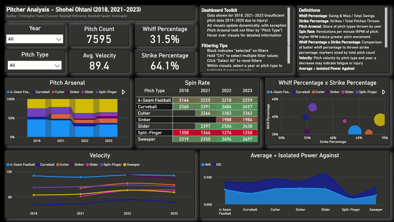

# Data Analysis Portfolio – Christopher Dunn

This portfolio showcases three end-to-end data analysis projects designed to demonstrate technical fluency across SQL, Python, Power BI, and Tableau. Each project highlights a distinct skill set relevant to data analyst-aligned roles, including data querying, transformation, statistical analysis, and visualization.  

All project files are included in this repository, including final outputs, SQL scripts, Jupyter notebooks, Power BI dashboards, and Tableau dashboards.

---

## Deliverables

1. **Federal Contract Analysis (SQL, Tableau)**  
   - [Interactive Tableau Dashboard](https://public.tableau.com/app/profile/christopher.dunn8263/viz/federal-contract-analysis/FederalContractAwardTransactions?publish=yes)  
   - 

2. **Hitter Analysis (Python, Google Slides)**  
   - [Professional scouting-style PDF](02-hitter-analysis/01-christopher-dunn-hitter-analysis.pdf)

3. **Pitcher Analysis (Python, DuckDB SQL, Power BI)**  
   - [Interactive Power BI Dashboard](https://app.powerbi.com/view?r=eyJrIjoiMTEwY2EyMjMtYTc4OS00Yjk2LTg0ODYtYzJmOWQxMmJjYTU2IiwidCI6IjFhNzRiYjQ5LTg5MGItNGE5YS1iMGJkLWY5MTk5ODg2YTY2YyIsImMiOjJ9)  
   - 

---

## Project Overviews

### 1. Federal Contract Analysis (SQL, Tableau)

**Objective:** Analyze federal contract award data from 2023-24 to answer “who, what, where, and when”.  
**Tools:** SQL (PostgreSQL), Tableau  

**Focus Areas:**  
- Agency- and recipient-level contract awards  
- Classification by North American Industry Classification System (NAICS) description  
- Regional award distribution by state  

**Process:** Queried 14 GB+ of 2023-24 federal contract data into PostgreSQL, cast dollar fields to numeric, validated dates, and standardized recipient names. Built modular views for top recipients, agencies, awards, and geographic spend. Exported flat files to Tableau Public and created interactive visuals leveraging calculated fields and parameters.

**Deliverables**  
- [Interactive Tableau Dashboard](https://public.tableau.com/app/profile/christopher.dunn8263/viz/federal-contract-analysis/FederalContractAwardTransactions?publish=yes)  
- [Tableau Dashboard Preview](01-federal-contract-analysis/01-dashboard-interaction.gif)

---

### 2. Hitter Analysis (Python, Google Slides)

**Objective:** Analyze Shohei Ohtani’s 2023 hitting tendencies to educate a hypothetical pitcher on how to pitch to Ohtani.  
**Tools:** Python (Jupyter, Pandas, NumPy, Seaborn, Matplotlib, pybaseball API), Google Slides  

**Focus Areas:**  
- Batting average by pitch type and location  
- Chase and whiff rates by count and pitch type  
- First-pitch in-zone swing tendencies by pitch type  

**Process:** Queried 2023 individual pitch data for Ohtani via pybaseball API, then enhanced it with pitch-type groupings, count context, and 5×5 location bins using pandas and NumPy. Calculated first-pitch swing rates, chase/whiff splits, and batting average heatmaps. Plotted visuals with matplotlib/seaborn, exported PNGs, and assembled a PDF report in Google Slides.

**Deliverable**  
- [Professional Scouting-Style PDF](02-hitter-analysis/01-christopher-dunn-hitter-analysis.pdf)

---

### 3. Pitcher Analysis (Python, DuckDB SQL, Power BI)

**Objective:** Analyze Shohei Ohtani’s 2018 and 2021-23 pitch data to unearth key trends in analytical categories.  
**Tools:** Python (Jupyter, Matplotlib, DuckDB SQL, pybaseball API), Power BI  

**Focus Areas:**  
- Batting average and isolated power against by pitch type  
- Pitch type distribution  
- Spin rate and velocity by pitch type  
- Whiff and strike percentages by pitch type  

**Process:** Queried 2018 and 2021-23 individual pitch data for Ohtani via pybaseball API and trimmed columns with DuckDB. Visualized pitch-level and time-series data in Power BI leveraging DAX to create measures and calculated columns.

**Deliverables**  
- [Interactive Power BI Dashboard](https://app.powerbi.com/view?r=eyJrIjoiMTEwY2EyMjMtYTc4OS00Yjk2LTg0ODYtYzJmOWQxMmJjYTU2IiwidCI6IjFhNzRiYjQ5LTg5MGItNGE5YS1iMGJkLWY5MTk5ODg2YTY2YyIsImMiOjJ9)  
- [Power BI Dashboard Preview](03-pitcher-analysis/01-dashboard-interaction.gif)

---

## Key Skills Demonstrated

- **SQL Data Modeling:** Cleaned and standardized 14 GB+ of contract data, applied window functions for recipient rankings and market-share metrics, and published reusable views that drive Tableau dashboards.  
- **Python Feature Engineering:** Automated data pulls, enriched datasets with pandas/NumPy, and used DuckDB SQL in Jupyter for rapid slicing of multi-season data.  
- **BI Data Visualization:** Built interactive Tableau and Power BI dashboards with custom visuals and dynamic, user-driven controls. Leveraged calculated fields, parameters, calculated columns, and measures.  
- **Performance Optimization and Workflow Ownership:** Queried data, pruned columns, enforced type casting, exported flat files, and managed the full workflow from raw extraction to polished public deliverables.  
- **Communication and Documentation:** Delivered PDF, public dashboards, GIF demos, and a version-controlled repository that translates complex analyses into concise insights.

---

## Contents

- `.twb`, `.pbix`, `.pdf` — Final report files  
- `.gif`, `.png` — Dashboard previews  
- `.ipynb` — Jupyter notebooks used in Python-based analysis  
- `.sql` — SQL scripts used in SQL-based analysis
